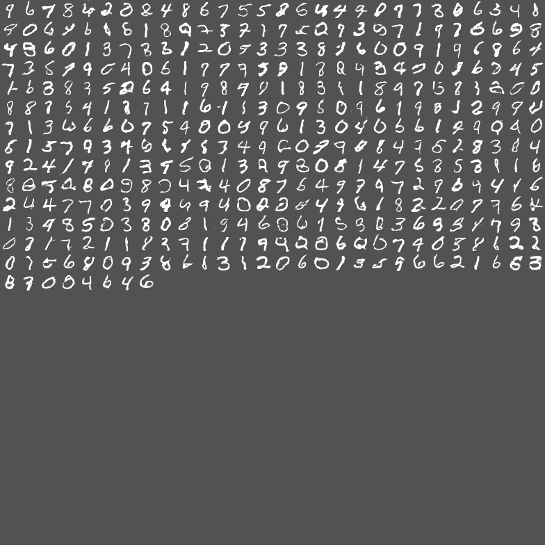

# DCGAN
Deep Convolutional Generative Adversarial Networks (DCGAN) on Tensorflow 

DCGAN

Full Paper here: https://arxiv.org/abs/1511.06434

Prerequisites:
1. Python 3.5
2. Tensorflow 1.1.0
3. scipy

Usage:
Run following commad
  $ python main.py
  
Results:
Generated image after 1st iteration

Generated image after 9000th iteration

